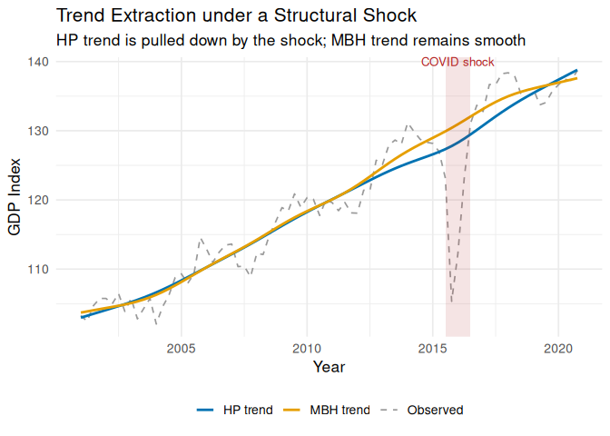

<!-- README.md is generated from README.Rmd. Please edit that file -->

# MacroFilters 

<!-- badges: start -->

[](https://lifecycle.r-lib.org/articles/stages.html#experimental)
[](https://github.com/michal0091/MacroFilters/actions/workflows/R-CMD-check.yaml)
<!-- badges: end -->

**MacroFilters** is a unified, high-performance library for extracting
trend and cycle components from macroeconomic time series. It combines
classical filters (Hodrick-Prescott, Hamilton, Boosted HP) with its
flagship algorithm, the **MacroBoost Hybrid (MBH)** — a
gradient-boosting filter with Huber loss that is *immune to structural
shocks* such as COVID-19, financial crises, and wars.

**Why MacroFilters instead of `mFilter` or `neverhpfilter`?**

- **Speed:** The HP filter uses sparse-matrix Cholesky factorisation
  (`Matrix`), scaling as *O(n)* instead of the dense *O(n³)* used by
  most implementations.
- **Robustness:** `mbh_filter()` replaces squared-error loss with Huber
  loss, so a single extreme quarter can never distort years of estimated
  trend.
- **Input agnosticism:** Pass a plain `numeric` vector, a `ts`, an
  `xts`, or a `zoo` object — the output always matches the input class,
  with no manual coercion required.

## Installation

``` r
# install.packages("devtools")
devtools::install_github("michal0091/MacroFilters")
```

## Quick Start

### Simulating a series with a COVID-19 shock

``` r
library(MacroFilters)
#> Registered S3 method overwritten by 'quantmod':
#>   method            from
#>   as.zoo.data.frame zoo

set.seed(42)
n    <- 80                              # ~20 years of quarterly data
time <- 1:n
# Long-run trend + business-cycle noise
y_true <- 100 + 0.5 * time + 3 * sin(2 * pi * time / 16)
y      <- y_true + rnorm(n, sd = 1.2)

# Inject a sharp COVID-like contraction in period 60
y[60] <- y[60] - 22
y[61] <- y[61] - 15
y[62] <- y[62] -  6

gdp_ts <- ts(y, start = c(2001, 1), frequency = 4)
```

### Extracting the trend with HP and MBH

``` r
hp_result  <- hp_filter(gdp_ts)
mbh_result <- mbh_filter(gdp_ts)

hp_result   # print S3 summary
#> -- MacroFilter [HP] --
#>    Observations : 80
#>    Parameters   : lambda = 1600
#>    Cycle range  : [-22.44, 5.885]  sd = 4.043
#>    Compute time : 0.019 s
mbh_result
#> -- MacroFilter [MBH] --
#>    Observations : 80
#>    Parameters   : knots = 40, d = 0.01, mstop = 500, nu = 0.2
#>    Cycle range  : [-15.86, 18.63]  sd = 10.83
#>    Compute time : 0.058 s
```

### Visualising the comparison

``` r
library(ggplot2)

quarters <- time(gdp_ts)
df <- data.frame(
  time   = as.numeric(quarters),
  data   = as.numeric(gdp_ts),
  HP     = as.numeric(hp_result$trend),
  MBH    = as.numeric(mbh_result$trend)
)

ggplot(df, aes(x = time)) +
  geom_line(aes(y = data, colour = "Observed"),  linewidth = 0.6, linetype = "dashed") +
  geom_line(aes(y = HP,   colour = "HP trend"),  linewidth = 1.0) +
  geom_line(aes(y = MBH,  colour = "MBH trend"), linewidth = 1.0) +
  annotate("rect",
           xmin = df$time[59], xmax = df$time[63],
           ymin = -Inf, ymax = Inf,
           alpha = 0.12, fill = "firebrick") +
  annotate("text",
           x = df$time[61], y = max(df$data),
           label = "COVID shock", vjust = -0.5,
           size = 3.5, colour = "firebrick") +
  scale_colour_manual(
    values = c("Observed" = "grey60", "HP trend" = "#0072B2", "MBH trend" = "#E69F00")
  ) +
  labs(
    title   = "Trend Extraction under a Structural Shock",
    subtitle = "HP trend is pulled down by the shock; MBH trend remains smooth",
    x = "Year", y = "GDP Index", colour = NULL
  ) +
  theme_minimal(base_size = 13) +
  theme(legend.position = "bottom")
```



The HP trend dips noticeably during the shock window, treating the
extreme quarters as meaningful information about the long-run level. The
MBH trend glides through undisturbed — the Huber loss down-weights those
observations automatically.

## The Filter Arsenal

| Function | Method | Key Advantage |
|----|----|----|
| `hp_filter()` | Hodrick-Prescott (1997) | Sparse *O(n)* implementation |
| `hamilton_filter()` | Hamilton (2018) | OLS regression, no spurious cycles |
| `bhp_filter()` | Boosted HP — Phillips & Shi (2021) | Iterative fitting with BIC/ADF stopping |
| `mbh_filter()` | MacroBoost Hybrid | Robust to outliers via Huber loss |

All functions return a `macrofilter` S3 object. Access components with
`$trend`, `$cycle`, and `$meta`.

## Further Reading

See `vignette("introduction", package = "MacroFilters")` for a full
walkthrough covering input agnosticism, all four filters, and the S3
print/meta interface.
