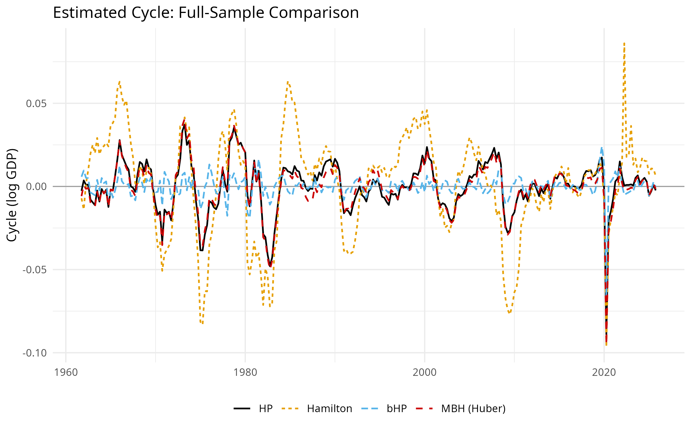

# MacroFilters 

<!-- badges: start -->

[](https://lifecycle.r-lib.org/articles/stages.html#experimental)
[](https://github.com/michal0091/MacroFilters/actions/workflows/R-CMD-check.yaml)
[](https://CRAN.R-project.org/package=MacroFilters)
[](https://doi.org/10.32614/CRAN.package.MacroFilters)
<!-- badges: end -->

> **Working Paper Available:** The econometric methodology and
> mathematical proofs underlying this package are distributed via SSRN:
> [Robust Real-Time Macroeconomic Trend Extraction: A Gradient Boosting
> Approach](https://doi.org/10.2139/ssrn.6371138).

**MacroFilters** is a unified, high-performance library for extracting
trend and cycle components from macroeconomic time series. It combines
classical filters (Hodrick-Prescott, Hamilton, Boosted HP) with its
flagship algorithm, the **MacroBoost Hybrid (MBH)** — a
gradient-boosting filter with Huber loss that is *immune to structural
shocks* such as COVID-19, financial crises, and wars.

**Why MacroFilters instead of `mFilter` or `neverhpfilter`?**

- **Robustness:** `mbh_filter()` replaces $L_2$ squared-error loss with
  Huber loss, ensuring extreme exogenous shocks never distort the
  structural trend.
- **Speed:** The HP implementation uses sparse-matrix Cholesky
  factorisation (`Matrix`), scaling as *O(n)* instead of the dense
  *O(n³)* used by legacy packages.
- **Input agnosticism:** Pass a plain `numeric` vector, a `ts`, an
  `xts`, or a `zoo` object — the output always matches the input class
  seamlessly.

## The End-Point Problem: Solved

During extreme black swan events, traditional filters anchored in $L_2$
loss mechanically deform the long-run structural trend to absorb
massive, transitory outliers.

As demonstrated with Real US GDP during the 2020 Q2 COVID-19 collapse,
the standard HP filter bends towards the shock. The MBH filter isolates
the exogenous shock entirely within the cyclical component, preserving
absolute trend integrity in real-time.


Furthermore, ex-ante spectral alignment ensures the MBH filter perfectly
matches the baseline cyclical volatility of the industry-standard HP
filter during normal conditions, unlike the excessively volatile
Hamilton filter.



*(Plots generated using real-time vintage data from the Federal Reserve
Economic Data - FRED).*

## Installation

``` r
# install.packages("devtools")
devtools::install_github("michal0091/MacroFilters")
```

## Quick Start Arsenal

| Function | Method | Key Advantage |
|----|----|----|
| `hp_filter()` | Hodrick-Prescott (1997) | Sparse *O(n)* implementation |
| `hamilton_filter()` | Hamilton (2018) | OLS regression, no spurious cycles |
| `bhp_filter()` | Boosted HP — Phillips & Shi (2021) | Iterative fitting with BIC/ADF stopping |
| `mbh_filter()` | MacroBoost Hybrid | Robust to outliers via Huber loss |

All functions return a list of class `c("macrofilter", "list")`.

``` r
library(MacroFilters)

# Fast, agnostic filtering on any time-series object
hp_result  <- hp_filter(us_gdp_xts)
mbh_result <- mbh_filter(us_gdp_xts)

# Access components directly
mbh_result$trend
mbh_result$cycle

# Add 95% bootstrap confidence bands and plot them
mbh_ci <- mbh_filter(us_gdp_xts, boot_iter = 50L)
autoplot(mbh_ci)            # ggplot: trend, observed series and confidence ribbon
```

## Further Reading

- `vignette("introduction", package = "MacroFilters")` — full
  walkthrough of all four filters and the S3 print/meta interface.
- `vignette("uncertainty_bands", package = "MacroFilters")` — confidence
  bands via block bootstrap and the `autoplot()` method.
