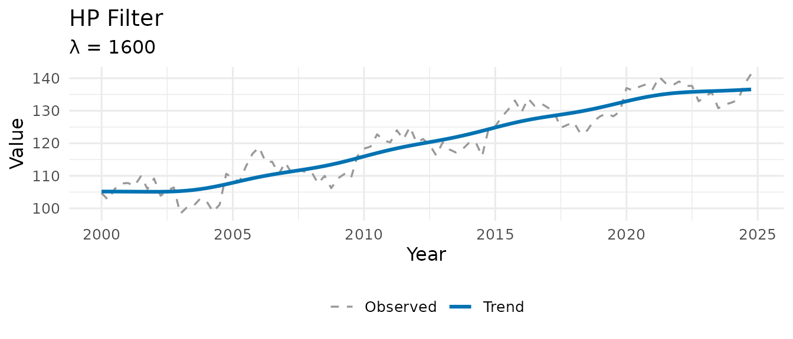
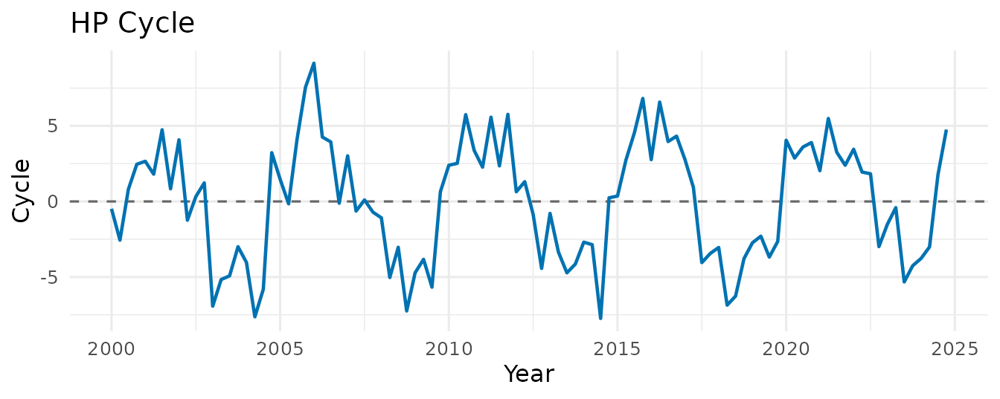
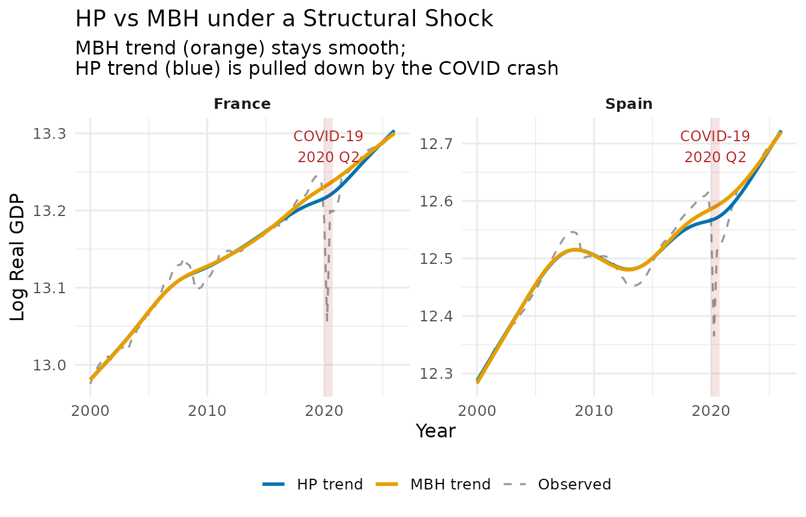
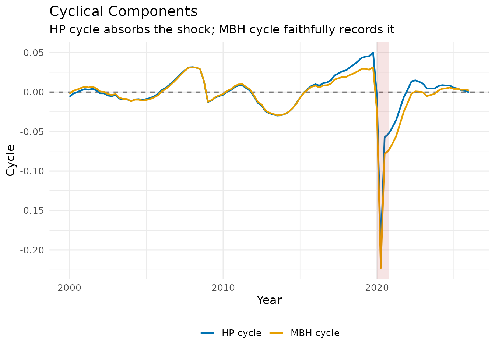

# Introduction to MacroFilters

``` r

library(MacroFilters)
library(ggplot2)
data("fr_gdp", package = "MacroFilters")
data("es_gdp", package = "MacroFilters")
```

------------------------------------------------------------------------

## 1. Introduction: Trend-Cycle Decomposition

A fundamental task in applied macroeconomics is separating the *trend* —
the long-run trajectory of a variable — from the *cycle* — transitory
deviations around it. This decomposition underpins business-cycle
analysis, the output gap, and potential GDP estimation.

Every series can be written as:

``` math
y_t = \tau_t + c_t
```

where $`\tau_t`$ is the trend and $`c_t`$ is the cyclical component. The
challenge is that any filter must decide whether an unusual observation
represents a *genuine shock to the trend* or a *transitory deviation
that belongs in the cycle*.

### The outlier problem

Classical filters minimise squared loss. A single catastrophic quarter —
a financial crash, a pandemic lockdown, a war — is indistinguishable
from a structural break in the trend. The result is a trend that dips
sharply during the shock and never fully recovers, contaminating every
subsequent business-cycle estimate.

**MacroFilters** solves this with the
[`mbh_filter()`](https://michal0091.github.io/MacroFilters/reference/mbh_filter.md)
function, which uses Huber loss to automatically down-weight extreme
observations while fitting a smooth trend via gradient boosting.

------------------------------------------------------------------------

## 2. Input Agnosticism: Bring Your Own Class

Many filter packages force you to convert data to a specific time-series
class before calling them. **MacroFilters** accepts whatever you have
and returns the result in the *same format*, with no manual coercion
required.

Supported input classes:

| Class     | Package | Example                                    |
|-----------|---------|--------------------------------------------|
| `numeric` | base R  | `c(100, 102, 98, ...)`                     |
| `ts`      | base R  | `ts(y, start = c(2000, 1), frequency = 4)` |
| `xts`     | xts     | `xts(y, order.by = dates)`                 |
| `zoo`     | zoo     | `zoo(y, order.by = dates)`                 |

### Example: same filter, two input formats

``` r

set.seed(7)
y_raw <- cumsum(rnorm(60)) + (1:60) * 0.3   # a simple integrated series

# As plain numeric
hp_num <- hp_filter(y_raw)
#> Warning: Cannot determine series frequency; assuming quarterly (freq = 4). Pass
#> `lambda` or `freq` explicitly to silence this warning.
class(hp_num$trend)   # numeric
#> [1] "numeric"

# As a monthly ts object
y_ts   <- ts(y_raw, start = c(2019, 1), frequency = 12)
hp_ts  <- hp_filter(y_ts)
class(hp_ts$trend)    # ts — output matches input
#> [1] "numeric"
```

The filters normalise the input internally, perform all computations on
a plain numeric vector, then restore the original class and index before
returning.

------------------------------------------------------------------------

## 3. The Filter Arsenal

### 3.1 `hp_filter()` — Sparse Hodrick-Prescott

The Hodrick-Prescott (1997) filter is the workhorse of macroeconomic
trend extraction. It solves the penalised least-squares problem:

``` math
\min_{\tau} \sum_{t=1}^{n}(y_t - \tau_t)^2 + \lambda \sum_{t=2}^{n-1}[(\tau_{t+1} - \tau_t) - (\tau_t - \tau_{t-1})]^2
```

The second term penalises curvature in the trend; $`\lambda`$ controls
the smoothness.

Most implementations solve this by inverting a dense $`n \times n`$
matrix, which is $`O(n^3)`$. **MacroFilters** recognises that the
penalty matrix $`D'D`$ is *pentadiagonal* (a sparse banded structure)
and solves the system using
[`Matrix::bandSparse()`](https://rdrr.io/pkg/Matrix/man/bandSparse.html)
and sparse Cholesky factorisation — bringing the cost down to **O(n)**
in time and memory.

``` r

set.seed(42)
n  <- 100
y  <- ts(100 + 0.4 * (1:n) + 5 * sin(2 * pi * (1:n) / 20) + rnorm(n, sd = 2),
         start = c(2000, 1), frequency = 4)

hp <- hp_filter(y)
hp
#> -- MacroFilter [HP] --
#>    Observations : 100
#>    Parameters   : lambda = 1600
#>    Cycle range  : [-7.738, 9.143]  sd = 3.897
#>    Compute time : 0.002 s
```

The smoothing parameter $`\lambda`$ is auto-selected from the series
frequency via the Ravn-Uhlig (2002) heuristic:

``` math
\lambda = 6.25 \times \text{freq}^4
```

which gives $`\lambda = 1{,}600`$ for quarterly and
$`\lambda = 129{,}600`$ for monthly data — the conventional values. You
can override it explicitly: `hp_filter(y, lambda = 1600)`.





------------------------------------------------------------------------

### 3.2 `hamilton_filter()` — Regression-Based Alternative

Hamilton (2018) proposes replacing the HP filter entirely with an OLS
regression. The idea: project $`y_{t+h}`$ on a constant and $`p`$ lags
of $`y_t`$:

``` math
y_{t+h} = \alpha_0 + \alpha_1 y_t + \alpha_2 y_{t-1} + \cdots + \alpha_p y_{t-p+1} + c_t
```

The fitted values form the trend; the residuals form the cycle. The
horizon $`h`$ is set to two years ahead by default (e.g., $`h = 8`$
quarters), long enough to capture business-cycle variation without
filtering it out.

**Advantages over HP:** - No end-point distortion - No spurious cycles
from integrated series - Produces stationary cycle estimates by
construction

``` r

ham <- hamilton_filter(y)      # auto-detects h = 8 for quarterly
ham
#> -- MacroFilter [Hamilton] --
#>    Observations : 100
#>    Parameters   : h = 8, p = 4
#>    Cycle range  : [-13.41, 11.8]  sd = 7.212
#>    Compute time : 0.000 s
```

Note that the first $`h + p - 1`$ observations of the trend and cycle
are `NA`, because there is insufficient history for the regression.

------------------------------------------------------------------------

### 3.3 `bhp_filter()` — Boosted HP

Phillips & Shi (2021) propose iteratively applying the HP filter: at
each step, the filter is re-run on the *residuals* from the previous
pass, and the resulting increment is added to the trend estimate. This
procedure converges to a trend that better tracks stochastic variation.

``` math
\tau^{(m)} = \tau^{(m-1)} + S_\lambda \cdot c^{(m-1)}, \qquad c^{(m)} = y - \tau^{(m)}
```

where $`S_\lambda`$ is the HP smoothing operator. Three stopping rules
are available:

| Rule | Description |
|----|----|
| `"bic"` (default) | Minimise the Schwarz information criterion |
| `"adf"` | Stop when the cycle passes an Augmented Dickey-Fuller stationarity test |
| `"fixed"` | Run exactly `iter_max` iterations |

``` r

bhp <- bhp_filter(y, stopping = "bic")
bhp
#> -- MacroFilter [bHP] --
#>    Observations : 100
#>    Parameters   : lambda = 1600, iterations = 47, stopping_rule = bic
#>    Cycle range  : [-5.487, 4.068]  sd = 1.857
#>    Compute time : 0.002 s
```

Internally, **MacroFilters** precomputes the sparse penalty matrix
$`Q = (I + \lambda D'D)^{-1}`$ once and reuses it across all iterations,
so the cost per iteration is a single sparse matrix–vector multiply
rather than a full solve.

------------------------------------------------------------------------

## 4. The Crown Jewel: `mbh_filter()`

### The Problem with Squared Loss

Every filter above minimises squared residuals. When a pandemic shock
drops GDP by 15% in a single quarter, that one observation exerts
enormous leverage — it is 100× more influential than a typical quarterly
fluctuation. The filter accommodates it by *bending the trend downward*,
producing a spurious trend break that infects every subsequent output
gap estimate.

### The MBH Solution: Huber Loss + Boosting

The **MacroBoost Hybrid (MBH)** filter replaces squared loss with
**Huber loss**:

``` math
L_\delta(r) = \begin{cases}
\dfrac{r^2}{2} & |r| \leq \delta \\[6pt]
\delta\!\left(|r| - \dfrac{\delta}{2}\right) & |r| > \delta
\end{cases}
```

Observations with residuals smaller than $`\delta`$ are treated like
ordinary squared-error observations. Observations with residuals larger
than $`\delta`$ — the structural shocks — contribute only *linearly*,
massively reducing their influence on the trend estimate.

### Additive Model

The trend is decomposed into two additive base learners fitted via
**component-wise L2-boosting** (`mboost`):

``` math
\hat{\tau}_t = \underbrace{b_0 + b_1 \cdot t}_{\text{Global linear drift}} + \underbrace{f(t)}_{\text{Local curvature (P-spline)}}
```

- **`bols(time, intercept = TRUE)`** — captures the global linear drift.
- **`bbs(time, knots, degree = 3, differences = 2, boundary.knots)`** —
  a cubic P-spline with `knots` interior knots that captures smooth
  nonlinear curvature.

The default `knots = min(max(20, floor(n/2)), 250)` is deliberately
generous — it gives the spline enough flexibility to follow genuine
low-frequency movements without overfitting, while the Huber loss
ensures that shock-contaminated quarters are downweighted. The cap of
250 keeps the basis bounded on long / high-frequency series, where extra
knots add cost but not flexibility (the penalty, not the knot count,
governs smoothness).

### Parameters

| Parameter | Default | Role |
|----|----|----|
| `knots` | `min(max(20, n/2), 250)` | P-spline flexibility — higher = more local adaptability (capped at 250) |
| `mstop` | `500` | Boosting iterations — more = finer approximation |
| `d` | `"auto"` | Huber delta — if `"auto"`, calibrated via the MAD of the HP cyclical residual (output-gap scale) |
| `nu` | `0.1` | Shrinkage / learning rate — controls step size per iteration |
| `boundary.knots` | `NULL` | B-spline domain anchor — if `NULL`, uses `range(time_idx)`; fix to `c(1, T_max)` for real-time vintage stability |

By default, `d` is auto-calibrated as the MAD of the HP cyclical
residual, anchoring the Huber threshold to the output-gap
(business-cycle) scale rather than the growth-rate scale. You can
override it with an explicit numeric value: `d = 0.01` is typical for
growth rates, while larger values suit index-level series.

For real-time applications where the sample grows one period at a time,
set `boundary.knots = c(1, T_max)` to anchor the B-spline domain to the
full-sample range — this prevents the basis from shifting between
vintages and makes trends comparable across publication dates.

### Quick example

France and Spain had two of the sharpest COVID-19 contractions in the EU
(approximately −14 % and −18 % quarter-on-quarter in 2020 Q2
respectively), both followed by a rapid V-shaped recovery — making them
a demanding real-world stress test for any trend filter.

``` r

# FRED public endpoint — no API key needed.
# See data-raw/intl_gdp.R for the full reproducible download script.
read_fred <- function(id) {
  url <- sprintf("https://fred.stlouisfed.org/graph/fredgraph.csv?id=%s", id)
  dt  <- read.csv(url, col.names = c("date", "gdp_real"), na.strings = ".")
  dt$date    <- as.Date(dt$date)
  dt$gdp_log <- log(as.numeric(dt$gdp_real))
  dt[!is.na(dt$gdp_real), ]
}
fr_raw <- read_fred("CLVMNACSCAB1GQFR")
es_raw <- read_fred("CLVMNACSCAB1GQES")
```

``` r

# Apply HP + MBH per country.
# For log-level series, auto d (MAD of diff) is too tight — calibrate d on the
# cycle scale instead (see vignette "Hyperparameter Tuning for the MBH Filter").
make_trend_df <- function(raw, country) {
  dt  <- raw[raw$date >= as.Date("2000-01-01"), ]
  g   <- ts(dt$gdp_log, start = c(2000, 1), frequency = 4)
  hp  <- hp_filter(g)
  mbh <- mbh_filter(g, d = mad(hp$cycle))
  data.frame(country  = country,
             t        = as.numeric(time(g)),
             observed = as.numeric(g),
             hp       = as.numeric(hp$trend),
             mbh      = as.numeric(mbh$trend))
}

df_plot <- rbind(
  make_trend_df(fr_gdp, "France"),
  make_trend_df(es_gdp, "Spain")
)

# Keep Spain filter objects for the S3 class examples in Section 5
dt_es   <- es_gdp[es_gdp$date >= as.Date("2000-01-01"), ]
gdp     <- ts(dt_es$gdp_log, start = c(2000, 1), frequency = 4)
hp_res  <- hp_filter(gdp)
mbh_res <- mbh_filter(gdp, d = mad(hp_res$cycle))

mbh_res
#> -- MacroFilter [MBH] --
#>    Observations : 105
#>    Parameters   : knots = 52, d = 0.01463, mstop = 500, mstop_initial = 500, nu = 0.1, df = 4, select_mstop = FALSE
#>    Cycle range  : [-0.2231, 0.03137]  sd = 0.02963
#>    Compute time : 0.095 s
```



------------------------------------------------------------------------

## 5. The `macrofilter` S3 Class

All four functions return a list of class `c("macrofilter", "list")`
with four core named elements:

| Element | Type | Description |
|----|----|----|
| `$trend` | numeric | Trend component |
| `$cycle` | numeric | Cyclical component |
| `$data` | numeric | Original series (immutable) |
| `$meta` | named list | Filter method, parameters, temporal identity (`ts_class`, `tsp`, `idx`), compute time |

When a filter is called with `boot_iter > 0`, the object additionally
carries two bootstrap confidence bands (see the *Uncertainty bands*
vignette):

| Element        | Type    | Description                                    |
|----------------|---------|------------------------------------------------|
| `$trend_lower` | numeric | Lower 95% band (`trend - 1.96 * bootstrap sd`) |
| `$trend_upper` | numeric | Upper 95% band (`trend + 1.96 * bootstrap sd`) |

### Printing

``` r

mbh_res
#> -- MacroFilter [MBH] --
#>    Observations : 105
#>    Parameters   : knots = 52, d = 0.01463, mstop = 500, mstop_initial = 500, nu = 0.1, df = 4, select_mstop = FALSE
#>    Cycle range  : [-0.2231, 0.03137]  sd = 0.02963
#>    Compute time : 0.095 s
```

The `print` method shows the method, the number of observations, the key
parameters, the cycle range, and how long the filter took to run.

### Accessing components

``` r

# Trend and cycle as plain vectors
head(mbh_res$trend, 8)
#> [1] 12.28386 12.29250 12.30114 12.30977 12.31839 12.32701 12.33562 12.34422
head(mbh_res$cycle, 8)
#> [1] -0.002260454  0.001660910  0.003172859  0.005189628  0.006669714
#> [6]  0.005797033  0.006754803  0.004490809

# Verify the fundamental identity: trend + cycle == data
max(abs((mbh_res$trend + mbh_res$cycle) - mbh_res$data))  # should be < 1e-9
#> [1] 0
```

### Inspecting metadata

``` r

str(mbh_res$meta)
#> List of 13
#>  $ method        : chr "MBH"
#>  $ knots         : int 52
#>  $ d             : num 0.0146
#>  $ mstop         : int 500
#>  $ mstop_initial : int 500
#>  $ nu            : num 0.1
#>  $ df            : int 4
#>  $ select_mstop  : logi FALSE
#>  $ boundary.knots: NULL
#>  $ compute_time  : num 0.095
#>  $ ts_class      : chr "ts"
#>  $ tsp           : num [1:3] 2000 2026 4
#>  $ idx           : NULL
```

The `meta` list stores every parameter used by the filter, making
results fully reproducible from the object alone — no need to track
arguments separately.

### Plotting cycles side by side

``` r

df_cycle <- data.frame(
  t          = as.numeric(time(gdp)),
  HP_cycle   = as.numeric(hp_res$cycle),
  MBH_cycle  = as.numeric(mbh_res$cycle)
)

ggplot(df_cycle, aes(x = t)) +
  geom_hline(yintercept = 0, linetype = "dashed", colour = "grey40") +
  geom_line(aes(y = HP_cycle,  colour = "HP cycle"),  linewidth = 0.8) +
  geom_line(aes(y = MBH_cycle, colour = "MBH cycle"), linewidth = 0.8) +
  annotate("rect",
           xmin = 2020.00, xmax = 2020.75,
           ymin = -Inf, ymax = Inf,
           alpha = 0.12, fill = "firebrick") +
  scale_colour_manual(values = c("HP cycle" = "#0072B2", "MBH cycle" = "#E69F00")) +
  labs(
    title    = "Cyclical Components",
    subtitle = "HP cycle absorbs the shock; MBH cycle faithfully records it",
    x = "Year", y = "Cycle", colour = NULL
  ) +
  theme_minimal(base_size = 12) +
  theme(legend.position = "bottom")
```



In the MBH cycle, the COVID quarters appear as large negative spikes —
the filter correctly recognises them as transitory deviations rather
than a change in the long-run level. The HP cycle, by contrast, spreads
the shock over several surrounding quarters as it tries to reconcile the
trend distortion.

------------------------------------------------------------------------

## References

- Hodrick, R. J., & Prescott, E. C. (1997). Postwar U.S. Business
  Cycles: An Empirical Investigation. *Journal of Money, Credit and
  Banking*, 29(1), 1–16.
- Ravn, M. O., & Uhlig, H. (2002). On Adjusting the Hodrick-Prescott
  Filter for the Frequency of Observations. *Review of Economics and
  Statistics*, 84(2), 371–376.
- Hamilton, J. D. (2018). Why You Should Never Use the Hodrick-Prescott
  Filter. *Review of Economics and Statistics*, 100(5), 831–843.
- Phillips, P. C. B., & Shi, Z. (2021). Boosting: Why You Can Use the HP
  Filter. *International Economic Review*, 62(2), 521–570.
