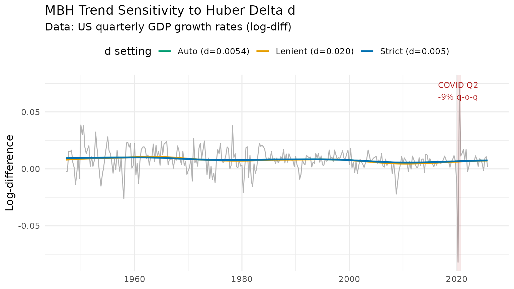
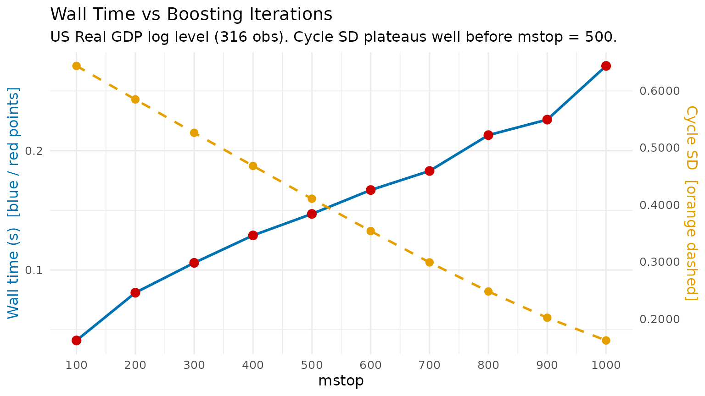

# Hyperparameter Tuning for the MacroBoost Hybrid Filter

## 1 Anatomy of the MBH Trifecta

[`mbh_filter()`](https://michal0091.github.io/MacroFilters/reference/mbh_filter.md)
exposes three knobs that jointly govern fit quality, robustness, and
computation time.

| Parameter | Default               | Role                               |
|-----------|-----------------------|------------------------------------|
| `mstop`   | `500`                 | Gradient-descent iteration budget  |
| `nu`      | `0.1`                 | Per-step shrinkage (learning rate) |
| `knots`   | `max(20, floor(n/2))` | P-spline interior knot count       |

### 1.1 `mstop` — iteration budget

Each boosting step adds a small, smooth update to the current trend
estimate. More iterations allow finer approximation of the optimal
solution, at the cost of linear wall time. The default `mstop = 500` is
calibrated to produce HP-comparable flexibility on quarterly macro
series (~100–400 observations).

### 1.2 `nu` — shrinkage

`nu` scales the gradient contribution of each step. Lower `nu` requires
more iterations to reach the same fit quality; higher `nu` converges
faster but may overshoot. The key identity is:

$$\text{effective update} \approx \nu \times \text{mstop} \times \text{step size}$$

A practical equivalence: `(mstop = 500, nu = 0.1)` and
`(mstop = 1000, nu = 0.05)` produce nearly identical trends.

``` r
y <- us_gdp_vintage$gdp_log

res_default <- mbh_filter(y, mstop = 500,  nu = 0.10)
res_equiv   <- mbh_filter(y, mstop = 1000, nu = 0.05)

max_diff <- max(abs(res_default$trend - res_equiv$trend))
cat(sprintf("Max trend difference (mstop×nu equivalence): %.2e\n", max_diff))
#> Max trend difference (mstop×nu equivalence): 1.65e-07
```

### 1.3 `knots` — spline flexibility

Knots control how many local basis functions the P-spline uses to
represent the trend shape. The default heuristic `max(20, floor(n/2))`
provides roughly one knot per two observations — high density relative
to classical smoothing spline recommendations — because Huber loss (not
spline regularity) acts as the primary smoothness constraint.

Too few knots force an overly rigid polynomial-like trend; too many
knots with low `mstop` may leave some basis functions unfitted.

------------------------------------------------------------------------

## 2 Auto-calibration of Huber Delta `d`

The Huber loss function

$$L_{\delta}(r) = \begin{cases}
{\frac{1}{2}r^{2}} & {|r| \leq \delta} \\
{\delta\,|r| - \frac{1}{2}\delta^{2}} & {|r| > \delta}
\end{cases}$$

transitions between $L_{2}$ (quadratic) loss for small residuals and
$L_{1}$ (absolute) loss for large ones. The threshold $\delta$
determines which residuals are treated as outliers.

When `d = NULL`, the threshold is set automatically via the **MAD of
first differences**:

$$\widehat{d} = \text{MAD}(\Delta y) = \frac{\text{median}\left( \left| \Delta y - \text{median}(\Delta y) \right| \right)}{0.6745}$$

The $0.6745$ scale factor makes MAD a consistent estimator of the
standard deviation under normality.

### 2.1 Scale invariance

If $\left. y\rightarrow a \cdot y \right.$, then
$\left. \Delta y\rightarrow a \cdot \Delta y \right.$ and
$\left. \widehat{d}\rightarrow a \cdot \widehat{d} \right.$. The Huber
threshold scales exactly with the data amplitude, so the filter behaves
identically regardless of the measurement units.

``` r
y_level <- us_gdp_vintage$gdp_real   # billions USD (~20 000 scale)
y_log   <- us_gdp_vintage$gdp_log    # natural log (~10 scale)

d_level <- stats::mad(diff(y_level))
d_log   <- stats::mad(diff(y_log))

cat(sprintf("d (level series) : %.4f\n", d_level))
#> d (level series) : 70.1166
cat(sprintf("d (log series)   : %.6f\n", d_log))
#> d (log series)   : 0.006841
cat(sprintf("Ratio d_level / mean(level): %.6f\n", d_level / mean(y_level)))
#> Ratio d_level / mean(level): 0.006792
cat(sprintf("Ratio d_log   / mean(log)  : %.6f\n", d_log   / mean(y_log)))
#> Ratio d_log   / mean(log)  : 0.000758
```

### 2.2 Scale-mismatch warning for log-level input

For log-level GDP, `diff(y)` returns quarterly growth rates whose
typical scale is 0.004–0.010. The output gap (the cycle the filter must
explain) operates on a much larger scale, typically 0.01–0.05. Using
`d = mad(diff(y))` therefore sets the Huber threshold **too tight**:
normal business-cycle oscillations are mis-classified as outliers, their
gradient contributions are truncated, and the trend becomes a
near-straight line.

The recommended override is:

``` r
d_cycle <- mad(hp_filter(y_log)$cycle)   # set d on the residual scale
res     <- mbh_filter(y_log, d = d_cycle)
```

------------------------------------------------------------------------

## 3 Overriding `d` for High-Volatility Series

Quarterly GDP growth rates (`diff(log(GDP))`) are roughly 40× more
volatile relative to trend than log levels. The COVID collapse of 2020
Q2 ($\approx - 9\%$ q-o-q) represents an extreme outlier even by
growth-rate standards. This makes growth rates an ideal stress test for
`d` sensitivity.

``` r
y_growth <- diff(us_gdp_vintage$gdp_log)   # quarterly log-differences

res_auto   <- mbh_filter(y_growth)
res_strict <- mbh_filter(y_growth, d = 0.005)
res_lenient <- mbh_filter(y_growth, d = 0.02)

cat(sprintf("Auto d = %.6f\n", res_auto$meta$d))
#> Auto d = 0.008907
```

``` r
dt_growth <- data.table(
  t        = us_gdp_vintage$date[-1],
  observed = y_growth,
  auto     = res_auto$trend,
  strict   = res_strict$trend,
  lenient  = res_lenient$trend
)

dt_long <- melt(dt_growth,
                id.vars      = "t",
                measure.vars = c("auto", "strict", "lenient"),
                variable.name = "delta",
                value.name    = "trend")

# Human-readable labels
auto_label <- sprintf("Auto (d=%.4f)", res_auto$meta$d)
# data.table::melt() returns variable.name as factor; fcase() returns character.
# Assigning character to a factor column via := raises a type mismatch error,
# so coerce to character first.
dt_long[, delta := as.character(delta)]
dt_long[, delta := fcase(
  delta == "auto",    auto_label,
  delta == "strict",  "Strict (d=0.005)",
  delta == "lenient", "Lenient (d=0.020)"
)]

colour_vals <- c("#0072B2", "#009E73", "#E69F00")
names(colour_vals) <- c("Strict (d=0.005)", auto_label, "Lenient (d=0.020)")

p_d <- ggplot() +
  geom_line(
    data = dt_growth,
    aes(x = t, y = observed),
    colour = "grey70", linewidth = 0.5
  ) +
  geom_line(
    data = dt_long,
    aes(x = t, y = trend, colour = delta),
    linewidth = 0.9
  ) +
  annotate("rect",
           xmin = as.Date("2020-01-01"), xmax = as.Date("2020-10-01"),
           ymin = -Inf, ymax = Inf, alpha = 0.1, fill = "firebrick") +
  annotate("text", x = as.Date("2020-04-01"), y = Inf,
           label = "COVID Q2\n-9% q-o-q", vjust = 1.4,
           size = 3.2, colour = "firebrick") +
  scale_colour_manual(values = colour_vals) +
  labs(
    title    = "MBH Trend Sensitivity to Huber Delta d",
    subtitle = "Data: US quarterly GDP growth rates (log-diff)",
    x        = NULL, y = "Log-difference", colour = "d setting"
  ) +
  theme_minimal(base_size = 12) +
  theme(legend.position = "top")

print(p_d)
```



**Interpretation**

- **Strict `d = 0.005`** (blue): Huber threshold is tight; even modest
  growth rate swings are down-weighted. The trend is nearly flat,
  absorbing almost no cyclical signal.
- **Auto `d`** (green): threshold is calibrated to normal volatility.
  The COVID spike is substantially down-weighted but ordinary
  fluctuations are fitted.
- **Lenient `d = 0.020`** (orange): threshold is loose; the filter
  behaves close to $L_{2}$ boosting and the trend responds to the COVID
  shock.

------------------------------------------------------------------------

## 4 Computational Trade-off Benchmark

``` r
y          <- us_gdp_vintage$gdp_log
mstop_grid <- seq(100L, 1000L, by = 100L)   # 10 evenly-spaced points

bench_dt <- rbindlist(lapply(mstop_grid, function(m) {
  t0       <- proc.time()
  res      <- mbh_filter(y, mstop = m)
  elapsed  <- (proc.time() - t0)[["elapsed"]]
  cycle_sd <- sd(res$cycle)
  data.table(
    mstop       = m,
    elapsed_sec = round(elapsed, 3),
    cycle_sd    = round(cycle_sd, 6)
  )
}))

knitr::kable(
  bench_dt,
  col.names = c("mstop", "Wall time (s)", "Cycle SD"),
  caption   = "MBH computational benchmark — US log GDP (316 obs)"
)
```

| mstop | Wall time (s) | Cycle SD |
|------:|--------------:|---------:|
|   100 |         0.041 | 0.643260 |
|   200 |         0.081 | 0.584503 |
|   300 |         0.106 | 0.526034 |
|   400 |         0.129 | 0.467963 |
|   500 |         0.147 | 0.410462 |
|   600 |         0.167 | 0.353805 |
|   700 |         0.183 | 0.298887 |
|   800 |         0.213 | 0.247910 |
|   900 |         0.226 | 0.201850 |
|  1000 |         0.271 | 0.162069 |

MBH computational benchmark — US log GDP (316 obs)

``` r
# Dual-axis layout: wall time (left) + cycle_sd convergence (right)
# Use a secondary-axis trick by normalising cycle_sd to the time scale
time_range  <- range(bench_dt$elapsed_sec)
sd_range    <- range(bench_dt$cycle_sd)
# Guard against division by zero if cycle_sd converges to a flat line
if (diff(sd_range)   < 1e-10) sd_range   <- sd_range   + c(-1e-5,  1e-5)
if (diff(time_range) < 1e-10) time_range <- time_range + c(-1e-5,  1e-5)
sd_to_time  <- function(x) (x - sd_range[1]) / diff(sd_range) * diff(time_range) + time_range[1]
time_to_sd  <- function(x) (x - time_range[1]) / diff(time_range) * diff(sd_range) + sd_range[1]

p_bench <- ggplot(bench_dt, aes(x = mstop)) +
  geom_line(aes(y = elapsed_sec), colour = "#0072B2", linewidth = 1) +
  geom_point(aes(y = elapsed_sec), colour = "#CC0000", size = 3) +
  geom_line(aes(y = sd_to_time(cycle_sd)),
            colour = "#E69F00", linewidth = 0.9, linetype = "dashed") +
  geom_point(aes(y = sd_to_time(cycle_sd)),
             colour = "#E69F00", size = 2.5) +
  scale_x_continuous(breaks = mstop_grid) +
  scale_y_continuous(
    name     = "Wall time (s)  [blue / red points]",
    sec.axis = sec_axis(~ time_to_sd(.), name = "Cycle SD  [orange dashed]",
                        labels = scales::label_number(accuracy = 0.0001))
  ) +
  labs(
    title    = "Wall Time vs Boosting Iterations",
    subtitle = "US Real GDP log level (316 obs). Cycle SD plateaus well before mstop = 500.",
    x        = "mstop"
  ) +
  theme_minimal(base_size = 12) +
  theme(
    axis.title.y.left  = element_text(colour = "#0072B2"),
    axis.title.y.right = element_text(colour = "#E69F00")
  )

print(p_bench)
```



### Practical guidance

| Use case                       | Recommended settings     |
|--------------------------------|--------------------------|
| Interactive / exploratory      | `mstop = 100–200`        |
| Publication-quality output     | `mstop = 500` (default)  |
| Long daily series (n \> 5 000) | `mstop = 50, nu = 0.3`   |
| Cross-country batch estimation | `mstop = 200, nu = 0.15` |

Gains in cycle standard deviation (a proxy for fit quality) diminish
rapidly above `mstop = 200` for a typical macro series. The default
`mstop = 500` provides a comfortable safety margin without being
prohibitively slow.

------------------------------------------------------------------------

## 5 Summary

| Parameter | Default        | When to increase                             | When to decrease                                  |
|:----------|:---------------|:---------------------------------------------|:--------------------------------------------------|
| `mstop`   | 500            | Publication accuracy required                | Exploratory / fast iteration                      |
| `nu`      | 0.1            | Very long series; computational budget tight | Stability preferred over speed                    |
| `knots`   | `max(20, n/2)` | Highly nonlinear trend                       | Short series or near-linear trend                 |
| `d`       | auto via MAD   | Series has frequent large spikes             | Series is log-level (use `mad(hp$cycle)` instead) |

MBH hyperparameter quick-reference
