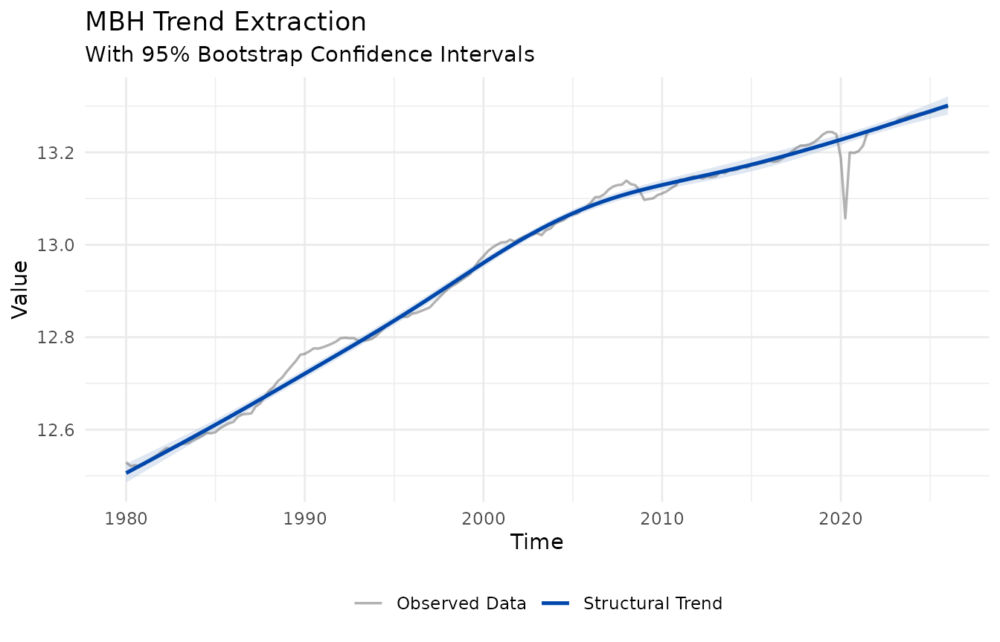
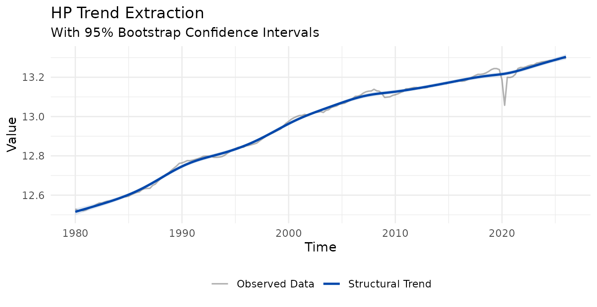
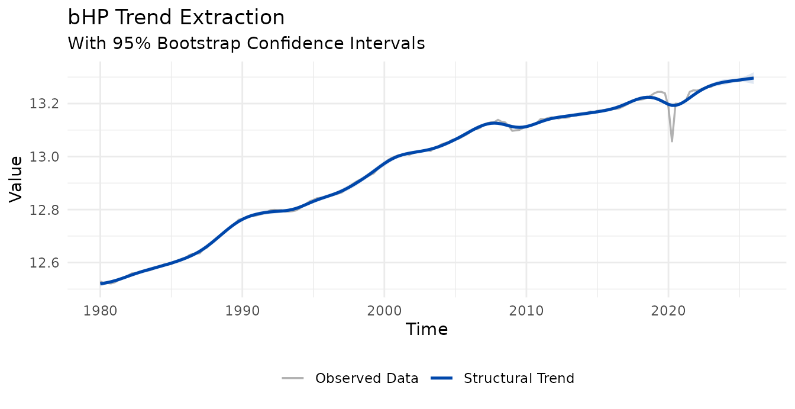
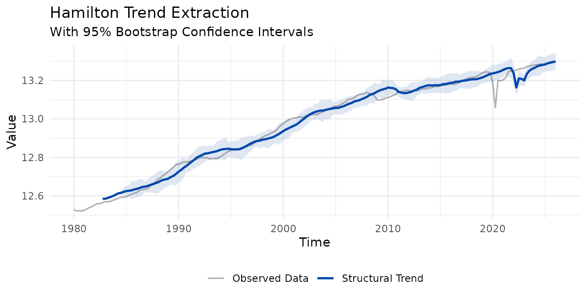
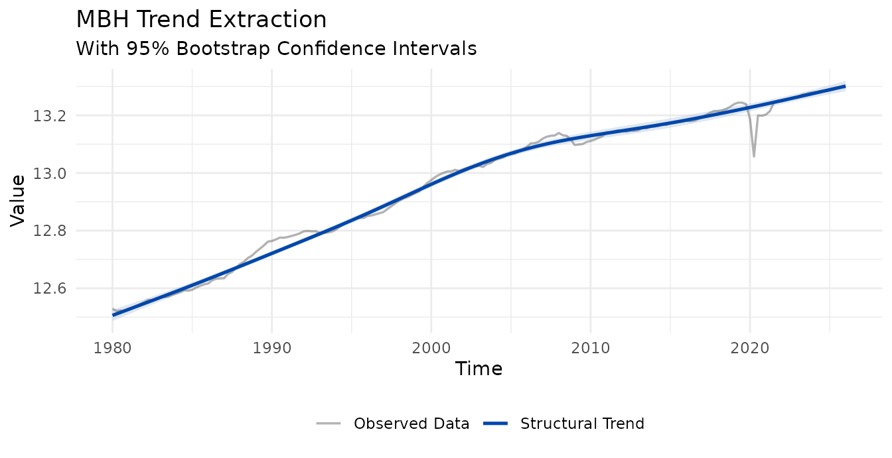

# Uncertainty Bands via Block Bootstrap

``` r

library(MacroFilters)
library(ggplot2)
data("fr_gdp", package = "MacroFilters")

# France real GDP (log level) as a quarterly ts; includes the 2020 Q2 COVID shock
d0 <- fr_gdp$date[1]
fr <- ts(
  fr_gdp$gdp_log,
  start     = c(as.integer(format(d0, "%Y")),
                (as.integer(format(d0, "%m")) - 1L) %/% 3L + 1L),
  frequency = 4
)
```

------------------------------------------------------------------------

## 1. Why quantify trend uncertainty?

A point estimate of the trend is only half the story. In real time the
trend is most uncertain exactly where it matters most — at the **end of
the sample**, where the smoother has no future observations to lean on.
Every filter in **MacroFilters** can attach a 95% confidence band to its
trend through a single argument, `boot_iter`.

``` r

fit <- mbh_filter(fr, boot_iter = 50L)   # mstop defaults to 500
#> Info: Huber threshold automatically calibrated to d = 0.010139 via HP cyclical MAD.
str(fit[c("trend_lower", "trend_upper")], max.level = 1)
#> List of 2
#>  $ trend_lower: num [1:185] 12.5 12.5 12.5 12.5 12.5 ...
#>  $ trend_upper: num [1:185] 12.5 12.5 12.5 12.5 12.5 ...
```

When `boot_iter > 0` the returned object gains `$trend_lower` and
`$trend_upper`; otherwise they are absent. Plotting is automatic —
[`autoplot()`](https://ggplot2.tidyverse.org/reference/autoplot.html)
draws the ribbon whenever the bands are present:

``` r

autoplot(fit)
```



The trend cuts almost straight through the 2020 COVID collapse: the
Huber loss treats the shock as an outlier rather than bending the trend
toward it.

------------------------------------------------------------------------

## 2. The mechanics

The engine is a **Circular Block Bootstrap** (Politis & Romano, 1992) of
the filter’s pseudo-residuals (the cycle):

1.  Resample the cycle in contiguous **blocks** that wrap around the
    series end, preserving short-run autocorrelation while giving every
    observation equal weight (no end-point under-representation).
2.  Rebuild a synthetic series `trend + resampled cycle` and **refit the
    same filter** to it. Each refit uses the *same estimator* as the
    base fit (same `mstop` for MBH, same iteration count for bHP), so
    the band width is not biased.
3.  The band is the **normal approximation**
    `trend ± 1.96 * sd(bootstrap trends)`, centred on the point
    estimate. The standard deviation is used instead of raw 2.5%/97.5%
    percentiles because it is smooth and stable at a practical
    `boot_iter` (percentiles need hundreds of replicates to avoid
    jitter).

Two knobs control it:

- **`boot_iter`** — number of bootstrap replicates (cost grows
  linearly).
- **`block_size`** — block length; `"auto"` (default) uses
  `2 * frequency` (two cycles), capped at `length(x) / 3` to keep at
  least three blocks.

``` r

# Quarterly data -> auto block size = 2 * 4 = 8
fit_b <- mbh_filter(fr, boot_iter = 50L, block_size = 8L)
#> Info: Huber threshold automatically calibrated to d = 0.010139 via HP cyclical MAD.
```

------------------------------------------------------------------------

## 3. Bands for every filter

The same machinery is available on all four filters. Note that MBH keeps
the default `mstop = 500`: for long log-level series, reducing `mstop`
collapses the trend (the Huber gradient is capped from the first
iteration, so the trend never climbs its full range).

``` r

autoplot(hp_filter(fr,       boot_iter = 50L))
```



``` r

autoplot(bhp_filter(fr,      boot_iter = 50L))
```



``` r

autoplot(hamilton_filter(fr, boot_iter = 50L))
```



``` r

autoplot(mbh_filter(fr,      boot_iter = 50L))
#> Info: Huber threshold automatically calibrated to d = 0.010139 via HP cyclical MAD.
```



### Reading the end-point fan

For all filters the band **widens toward the edges** — typically two to
three times the mid-sample width. This is honest, not a bug: estimating
the trend at `t = n` with no future data is genuinely far more uncertain
than in the interior. It is precisely the *end-point problem* these
filters are designed to expose.

### A note on the Hamilton band

The Hamilton filter is a regression on lags of the series, so its first
`h + p - 1` observations have no fitted trend (they appear as `NA`,
leaving a gap at the start of the plot). Its bootstrap is **conditional
on those initial observations**: the lead-in is held fixed across
replicates. As a result the band is narrow at the start of the valid
window — where the predictors are the frozen lead-in and only the
regression coefficients vary — and widens forward as the predictors
themselves become resampled quantities.

------------------------------------------------------------------------

## 4. References

- Politis, D.N. and Romano, J.P. (1992). A circular block-resampling
  procedure for stationary data. In *Exploring the Limits of the
  Bootstrap*, 263–270.
- Künsch, H.R. (1989). The jackknife and the bootstrap for general
  stationary observations. *Annals of Statistics*, 17(3), 1217–1241.
