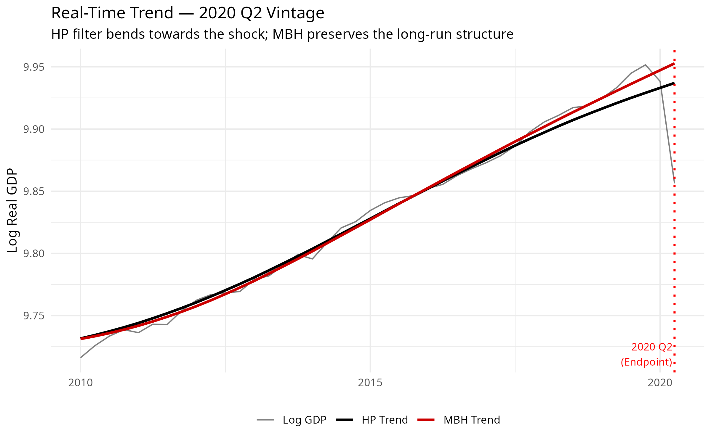

# MacroFilters

[](https://lifecycle.r-lib.org/articles/stages.html#experimental)
[](https://github.com/michal0091/MacroFilters/actions/workflows/R-CMD-check.yaml)

**MacroFilters** is a unified, high-performance library for extracting
trend and cycle components from macroeconomic time series. It combines
classical filters (Hodrick-Prescott, Hamilton, Boosted HP) with its
flagship algorithm, the **MacroBoost Hybrid (MBH)** — a
gradient-boosting filter with Huber loss that is *immune to structural
shocks* such as COVID-19, financial crises, and wars.

**Why MacroFilters instead of `mFilter` or `neverhpfilter`?**

- **Robustness:**
  [`mbh_filter()`](https://michal0091.github.io/MacroFilters/reference/mbh_filter.md)
  replaces $L_{2}$ squared-error loss with Huber loss, ensuring extreme
  exogenous shocks never distort the structural trend.
- **Speed:** The HP implementation uses sparse-matrix Cholesky
  factorisation (`Matrix`), scaling as *O(n)* instead of the dense
  *O(n³)* used by legacy packages.
- **Input agnosticism:** Pass a plain `numeric` vector, a `ts`, an
  `xts`, or a `zoo` object — the output always matches the input class
  seamlessly.

## The End-Point Problem: Solved

During extreme black swan events, traditional filters anchored in
$L_{2}$ loss mechanically deform the long-run structural trend to absorb
massive, transitory outliers.

As demonstrated with Real US GDP during the 2020 Q2 COVID-19 collapse,
the standard HP filter bends towards the shock. The MBH filter isolates
the exogenous shock entirely within the cyclical component, preserving
absolute trend integrity in real-time.



Furthermore, ex-ante spectral alignment ensures the MBH filter perfectly
matches the baseline cyclical volatility of the industry-standard HP
filter during normal conditions, unlike the excessively volatile
Hamilton filter.


*(Plots generated using real-time vintage data from the Federal Reserve
Economic Data - FRED).*

## Installation

``` r
# install.packages("devtools")
devtools::install_github("michal0091/MacroFilters")
```

## Quick Start Arsenal

| Function                                                                                      | Method                             | Key Advantage                           |
|-----------------------------------------------------------------------------------------------|------------------------------------|-----------------------------------------|
| [`hp_filter()`](https://michal0091.github.io/MacroFilters/reference/hp_filter.md)             | Hodrick-Prescott (1997)            | Sparse *O(n)* implementation            |
| [`hamilton_filter()`](https://michal0091.github.io/MacroFilters/reference/hamilton_filter.md) | Hamilton (2018)                    | OLS regression, no spurious cycles      |
| [`bhp_filter()`](https://michal0091.github.io/MacroFilters/reference/bhp_filter.md)           | Boosted HP — Phillips & Shi (2021) | Iterative fitting with BIC/ADF stopping |
| [`mbh_filter()`](https://michal0091.github.io/MacroFilters/reference/mbh_filter.md)           | MacroBoost Hybrid                  | Robust to outliers via Huber loss       |

All functions return a `macrofilter` S3 object.

``` r
library(MacroFilters)

# Fast, agnostic filtering on any time-series object
hp_result  <- hp_filter(us_gdp_xts)
mbh_result <- mbh_filter(us_gdp_xts)

# Access components directly
mbh_result$trend
mbh_result$cycle
```

## Further Reading

See
[`vignette("introduction", package = "MacroFilters")`](https://michal0091.github.io/MacroFilters/articles/introduction.md)
for a full walkthrough covering all four filters and the S3 print/meta
interface.
